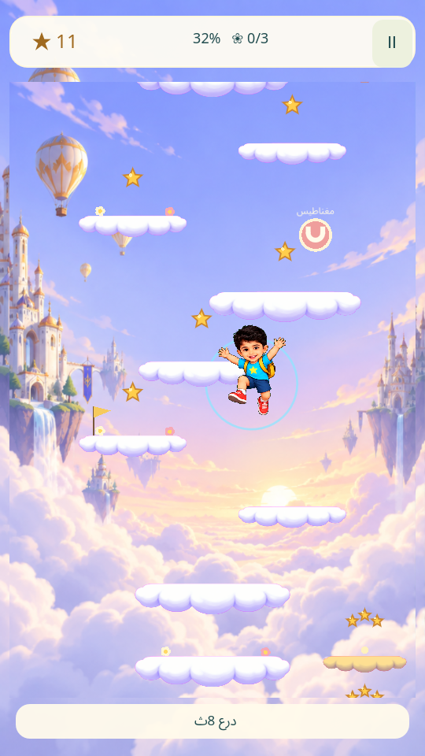
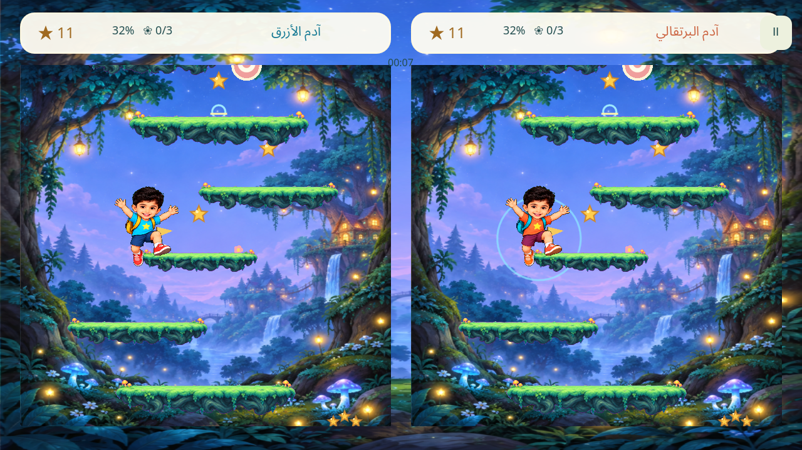

# مغامرات آدم · Adam's Summit

لعبة قفز ثنائية الأبعاد للعائلة: اجمع النجوم، تجاوز العقبات، واصعد إلى قمة المرحلة.

**[تحميل النسخ التجريبية — v0.6.1](https://github.com/linkq8/adam-summit/releases/tag/v0.6.1)**

- خمسة عوالم، ثلاثة مراحل لكل عالم، وثلاثة مستويات صعوبة.
- الهاتف: لاعب واحد، شاشة عمودية، والتحريك بالسحب بالإصبع.
- التلفاز: شاشة أفقية، لاعب واحد أو لاعبان، سباق أو تعاون بيد التحكم.
- منصات بأحجام مختلفة، ومنصات تنكسر بعد قفزة أو قفزتين، ونقاط حفظ ومكافآت وملابس.
- في هذا الإصدار: مسارات متعرجة ومسافات تتطلب تحريك اللاعب؛ الوقوف في مكان واحد لا يُكمل المرحلة.

## صور اللعبة





## Downloads

Download the Android APK, macOS ZIP, and unsigned iOS IPA from [Releases](https://github.com/linkq8/adam-summit/releases). SHA-256 checksums are provided with each release.

These are development builds. The public iOS IPA has its development provisioning profile and signatures removed: it requires your own Apple signing/provisioning before installation. It is not an App Store or TestFlight distribution. The macOS build is not notarized.

Android uses the Godot OpenGL compatibility renderer and requires OpenGL ES 3.0 support. Older GLES2-only TV sticks, including the original Full HD Mi TV Stick, are not supported. Performance on physical Android TV devices, Shield, newer Xiaomi sticks, foldables and controllers still needs hardware testing. Xbox, PlayStation and Nintendo controller operation depends on pairing and the host OS mappings; support across every controller model has not been verified.

## Run from source

Open `project.godot` in Godot 4.7.2 with matching export templates, then run the main scene. The game runs locally; it has no accounts, ads, photo uploads or network gameplay.

```sh
godot --path .
godot --path . -- --tv
```

### Export

- **Android:** install Godot's Android build template and the Android SDK/JDK, run `python3 scripts/prepare_android.py`, configure local SDK paths in Godot, then export the Android preset. Signing keys are intentionally not included.
- **macOS:** export the macOS preset with matching templates; distribution outside development requires your own signing/notarization.
- **iOS:** set your own Apple team in the iOS export preset, export the Xcode project, and configure signing in Xcode for your devices. No Apple team, certificates or provisioning profiles are included in the source.

### Regression checks

After importing the project, run:

```sh
godot --headless --editor --path . --import
godot --headless --path . --script tests/test_race.gd
godot --headless --path . --script tests/test_features.gd
godot --headless --path . --script tests/test_ui.gd
godot --headless --path . --script tests/test_spacing.gd
```

Coverage includes all 45 stage/difficulty combinations, optional routes, platform durability, saving, controls and stationary-player progression. The spacing checks include five simulated minutes without input for each combination.

## Assets

The repository contains the cartoon game character and production artwork. The original reference photograph and personal development files are excluded. The bundled font license is in `assets/FONT-LICENSE.txt`.
