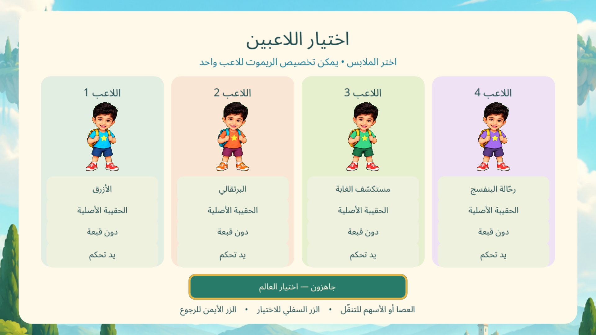
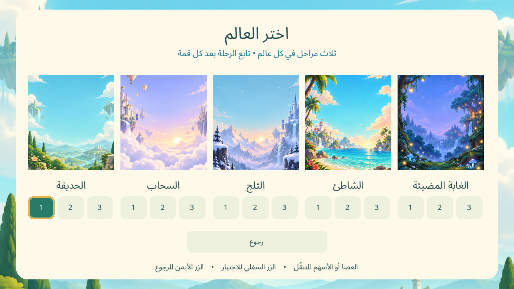

# مغامرات آدم · Adam's Summit

لعبة قفز ثنائية الأبعاد للعائلة: اجمع النجوم واصعد إلى قمة المرحلة.

**[تحميل النسخة التجريبية 0.7.0](https://github.com/linkq8/adam-summit/releases/tag/v0.7.0)**

- خمسة عوالم، ثلاث مراحل لكل عالم، وثلاثة مستويات صعوبة.
- الهواتف والأجهزة اللوحية: لاعب واحد وتحريك بالسحب بالإصبع.
- التلفاز: من لاعب إلى أربعة لاعبين، سباق أو تعاون، مع متابعة المراحل والعوالم.
- اختيار مستقل للملابس والحقائب والقبعات، وقائمة مصوّرة للعوالم.
- القوائم تعمل بأزرار الاتجاه والعصا؛ الزر السفلي للاختيار والزر الأيمن للرجوع. يمكن تخصيص ريموت واحد للاعب واحد واستخدام أيدي التحكم للبقية.
- إعدادات دقة التلفاز: متوازنة 1080p، دقة الشاشة الأصلية، أو اقتصادية 720p.





## التحديث من داخل اللعبة

ثبّت الإصدار 0.7.0 يدويًا مرة واحدة، ثم اختر **الإعدادات ← تحديث اللعبة عبر GitHub** للتحديثات التالية.

على Android، تتحقق اللعبة من إصدارات المستودع العامة (بما فيها النسخ التجريبية)، وتنزّل APK عند اختيارك، وتتحقق من بصمة SHA-256، ثم تفتح مثبّت Android. قد يطلب النظام السماح للتطبيق بتثبيت التحديثات. يلزم الاحتفاظ بمفتاح توقيع Android نفسه في الإصدارات اللاحقة.

على macOS تُفتح صفحة التنزيل. ملف iOS العام غير موقّع ويحتاج توقيع Apple قبل التثبيت؛ لا يوجد تثبيت مباشر لتحديثات GitHub على iPhone أو توزيع TestFlight في هذا المشروع.

اللعبة محلية دون حسابات أو إعلانات أو تحليلات. يُستخدم الإنترنت فقط عندما تطلب التحقق من التحديثات أو تنزيلها.

## Build from source

Use Godot 4.7.2 and matching export templates. Open `project.godot`, then run the main scene. Desktop TV preview:

```sh
godot --path . -- --tv
```

For Android, install the Android build template and SDK/JDK, then run `python3 scripts/prepare_android.py` before exporting. The script includes TV detection and the native APK installer/FileProvider bridge. Configure local signing keys in Godot; none are included here. Export macOS using its preset. For iOS, set your own Apple team, export the Xcode project and sign using your own provisioning. The macOS build is not notarized.

## Validation and device limits

Simulation, feature, UI, controller-menu and four-player progression tests passed. Live GitHub metadata retrieval and APK download/hash verification passed. The native Android installer opened and completed an update on an emulator. A desktop four-player 1080p sample measured 58 FPS with 22.2ms p95 frame time; this is not a Shield or Xiaomi hardware measurement.

Android requires OpenGL ES 3.0. The original GLES2-only Full HD Mi TV Stick is unsupported. Newer Xiaomi sticks, Shield, individual Xbox/PlayStation/Nintendo controller models, foldables and physical 4K TV performance still require hardware validation. Android may expose a lower-resolution app surface than the television's panel resolution.

```sh
godot --headless --editor --path . --import
godot --headless --path . --script tests/test_race.gd
godot --headless --path . --script tests/test_features.gd
godot --headless --path . --script tests/test_ui.gd -- --test
godot --headless --path . --script tests/test_controller_menu.gd -- --test
godot --headless --path . --script tests/test_four_updates.gd -- --test
```

`tests/test_update_download.gd` additionally downloads an APK from GitHub to verify the complete download/hash path. Test scripts using `--test` use separate save storage. See [TV design and validation notes](docs/TV-070.md).

## Design and assets

The TV profile selection takes inspiration from [Netflix's profile cards on Mobbin](https://mobbin.com/screens/9b0cfc61-f627-4691-b3a8-b4ea35110aad), adapted to the game's Arabic interface and original cartoon artwork. The original reference photograph, personal files and signing profiles are excluded. Font licensing is in `assets/FONT-LICENSE.txt`.
