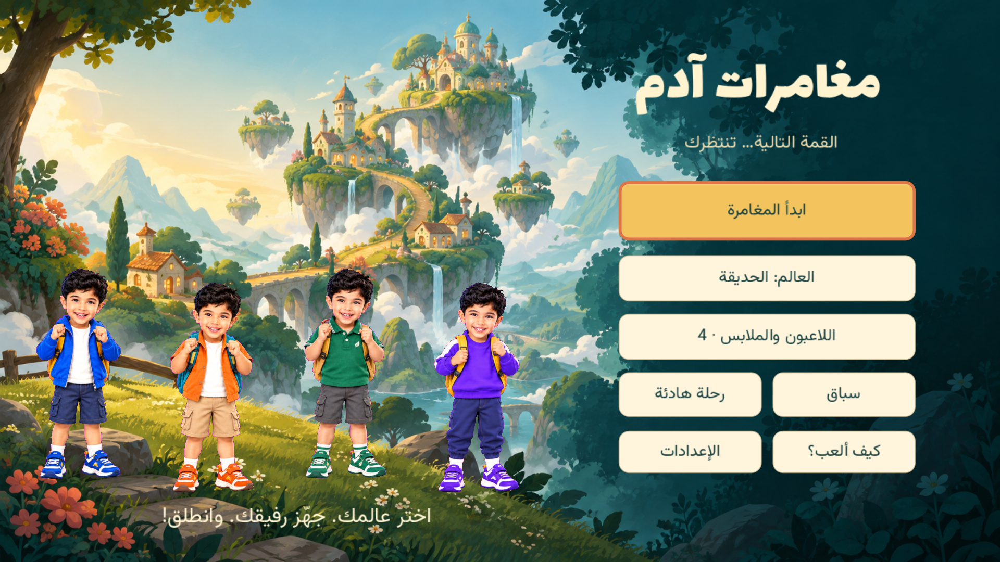
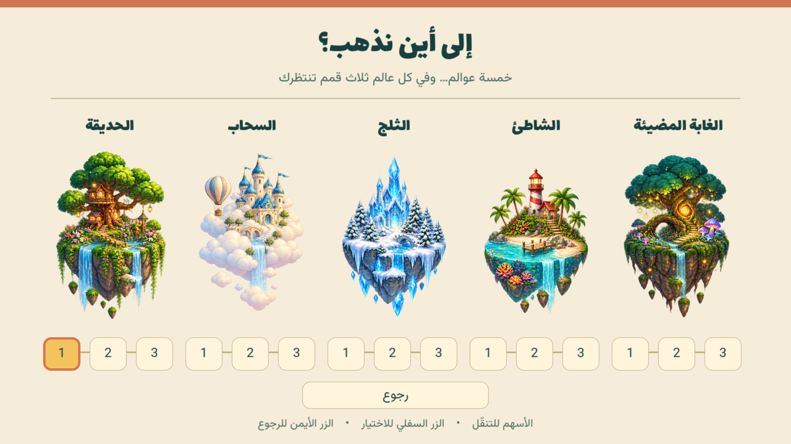
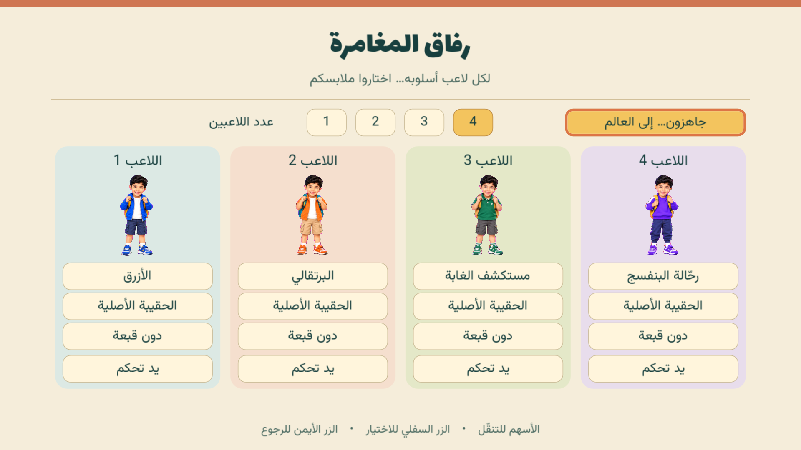
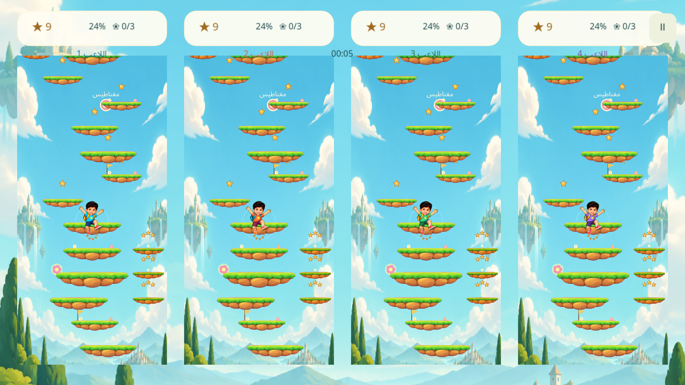

# مغامرات آدم · Adam's Summit

لعبة قفز ثنائية الأبعاد للعائلة: اجمع النجوم واصعد إلى قمة المرحلة.

**[تحميل النسخة التجريبية 0.8.8](https://github.com/linkq8/adam-summit/releases/tag/v0.8.8)**

- خمسة عوالم، ثلاث مراحل لكل عالم، وثلاثة مستويات صعوبة.
- الهواتف والأجهزة اللوحية: لاعب واحد وتحريك بالسحب بالإصبع.
- التلفاز: من لاعب إلى أربعة لاعبين، سباق أو تعاون أو «سباق المفاجآت»، مع متابعة المراحل والعوالم.
- كل مرحلة الآن 52 قفزة. مراحل العالم الثلاث تتدرج من الاستكشاف إلى التوقيت ثم قمة خاصة بالعالم.
- زنبرك رأسي يحسب قفزته حسب المرحلة ويتجاوز منصة على الأقل، مع مستنقعات وفخاخ لاصقة وتأخير اصطدام محسوب.
- في «سباق المفاجآت» لكل لاعب صناديق مستقلة وأداة واحدة: درع، حبر، لاصق، قفزتان مضاعفتان، أو إخفاء الخصم مؤقتًا.
- اختيار مستقل للملابس والحقائب، وقائمة مصوّرة للعوالم.
- القوائم تعمل بأزرار الاتجاه والعصا؛ الزر السفلي للاختيار والزر الأيمن للرجوع. يمكن تخصيص ريموت واحد للاعب واحد واستخدام أيدي التحكم للبقية.
- إعدادات دقة التلفاز: متوازنة 1080p، دقة الشاشة الأصلية، أو اقتصادية 720p.






## التحديث من داخل اللعبة

ثبّت الإصدار 0.7.0 يدويًا مرة واحدة، ثم اختر **الإعدادات ← تحديث اللعبة عبر GitHub** للتحديثات التالية.

على Android، تتحقق اللعبة من إصدارات المستودع العامة (بما فيها النسخ التجريبية)، وتنزّل APK عند اختيارك، وتتحقق من بصمة SHA-256، ثم تفتح مثبّت Android. قد يطلب النظام السماح للتطبيق بتثبيت التحديثات. يلزم الاحتفاظ بمفتاح توقيع Android نفسه في الإصدارات اللاحقة.

على macOS تُفتح صفحة التنزيل. ملف iOS العام غير موقّع ويحتاج توقيع Apple قبل التثبيت؛ لا يوجد تثبيت مباشر لتحديثات GitHub على iPhone أو توزيع TestFlight في هذا المشروع.

اللعبة محلية دون حسابات أو إعلانات أو تحليلات. يُستخدم الإنترنت فقط عندما تطلب التحقق من التحديثات أو تنزيلها.

## Build from source

Use Godot 4.7.2 and matching export templates. Open `project.godot`, then run the main scene. Desktop TV preview:

```sh
godot --path . -- --tv
```

For Android, install the Android build template and SDK/JDK, then run `python3 scripts/prepare_android.py` before exporting. The script includes TV detection and the native APK installer/FileProvider bridge. Configure local signing keys in Godot; none are included here. Export macOS using its preset. For iOS, set your own Apple team, export the Xcode project and sign using your own provisioning. The macOS build is not notarized.

## Validation and device limits

Simulation, feature, surprise-mode, UI, controller-menu and four-player progression tests passed. Live GitHub metadata retrieval and APK download/hash verification passed. The native Android installer opened and completed an update on an emulator. The 0.8.0 desktop four-view benchmark measured 162.6 µs median scene-update CPU time, 187 median draw calls and 5.875 ms uncapped frame p95. These are desktop measurements, not Shield or Xiaomi hardware results. See [benchmark method and limits](design/PERFORMANCE-071.md).

Android requires OpenGL ES 3.0. The original GLES2-only Full HD Mi TV Stick is unsupported. Newer Xiaomi sticks, Shield, individual Xbox/PlayStation/Nintendo controller models, foldables and physical 4K TV performance still require hardware validation. Android may expose a lower-resolution app surface than the television's panel resolution.

```sh
godot --headless --editor --path . --import
godot --headless --path . --script tests/test_race.gd
godot --headless --path . --script tests/test_features.gd
godot --headless --path . --script tests/test_surprise.gd
godot --headless --path . --script tests/test_ui.gd -- --test
godot --headless --path . --script tests/test_controller_menu.gd -- --test
godot --headless --path . --script tests/test_four_updates.gd -- --test
```

`tests/test_update_download.gd` additionally downloads an APK from GitHub to verify the complete download/hash path. Test scripts using `--test` use separate save storage. See [TV design and validation notes](docs/TV-070.md).

## Design and assets

Version 0.7.3 adds four newly drawn Adam outfits with five animation poses each, registered feet and hat anchors, and a dedicated character shader. See [character art and validation](design/CHARACTERS-073.md).

The 0.7.1 menus use original painterly camp and island artwork, Lalezar Arabic headings and Vazirmatn body text, informed by [Mobbin references](https://mobbin.com/screens/2656db04-1eb5-4568-9e7d-132256423855). See [design rationale](DESIGN.md) and [generated-art prompts](design/ART-080.md). No gameplay features were added in this refinement. The original reference photograph, personal files and signing profiles are excluded. Font licensing is in `assets/FONT-LICENSE.txt` and `assets/fonts/*OFL.txt`.

Version 0.7.4 redraws the jump, descent and landing as focused adventure movement. [Details](design/ADVENTURE-074.md).

Version 0.7.5 uses seven compact jump poses plus idle/victory, with feet kept under the body for clearer landings. [Details](design/JUMP-075.md).

Version 0.7.6 restores Adam’s natural likeness across all four outfits, retains the approved seven-phase jump, aligns the sole midpoint when facing either direction, and removes hats. [Art and validation](design/IDENTITY-V8.md).

Version 0.8.0 extends every stage from 34 to 52 jumps and gives each three-stage world distinct pacing. Springs use a stage-specific launch profile; mud, sticky traps and creatures delay the next launch without altering descent speed. TV adds «سباق المفاجآت» for two to four players. Independent boxes provide a six-second one-hit shield, 1.8-second seeded ink splats covering about 40% of the playfield, a 0.4-second sticky delay, two boosted jumps, or a 1.2-second invisibility penalty. Attacks target the nearest racer ahead, do not stack, and boxes end well before the summit.

Version 0.8.1 replaces the fixed edge ink with seeded organic splats distributed randomly across the playfield at about 40% coverage. A new hand-painted transparent atlas supplies the chest, shield, ink, sticky trap, spring and invisibility art. Pickup/use/hit pulses, visible shield and delay states, slim HUD progress rails, held-item icons and subtle world-colored atmosphere complete the visual pass. Reduced-effects mode keeps a cheaper contour variant.


Version 0.8.2 redraws the spring upright and calculates a useful two- or three-platform target for every stage. Raised gold alternate routes use unequal spacing and widths; double chevrons mark only routes verified to save time. The touch item action is sized for iOS/Android and appears only when a multiplayer surprise race has a valid opponent.

Version 0.8.3 removes the fixed 540×960 phone window override and uses the physical iOS/Android display aspect with expand scaling. Tall phones and foldables now fill the complete screen while safe-area insets continue to protect the Dynamic Island, camera area and home indicator.

Version 0.8.4 makes the single-player phone playfield edge-to-edge and removes the second differently cropped background that formed a visible rectangle inside the screen. TV split-screen panels keep independent backgrounds.


## Version 0.8.5

- A more compact phone HUD exposes more of the stage.
- The movement guide fades out during normal play and returns briefly when useful.
- A subtle landing marker helps phone players judge where a descending jump will land.
- Gameplay physics, scoring, and TV multiplayer behavior are unchanged.


## Version 0.8.6

Stage 1-1 now has smaller main platforms, a wider range of jump heights, and more than twenty additional route surfaces. Mud can be skirted on its clear edge or bypassed on a raised side route. Seven new coral platforms break on first contact, and every one has a permanent green alternative so the climb cannot become a dead end. These geometry changes apply only to the first stage.


## Version 0.8.7

Stage 1-1 has smaller landings and a wider range of jump heights. Three violet platforms collapse on contact without launching the player; each has a safe green bypass. A new solo Endless Climb gradually narrows and raises the platforms as the player ascends. Falling ends the run immediately, with a local best score based on maximum height.


## Version 0.8.8

Stage 1-1 and Endless Climb now use smaller platforms and greater variation in jump heights. The playfield camera zooms out by 10% on phone and TV so players can see more of the climb; touch steering compensates for the new scale. Safe routes remain available around every immediate-collapse platform.
