# مغامرات آدم · Adam's Summit

لعبة قفز ثنائية الأبعاد للعائلة: اجمع النجوم واصعد إلى قمة المرحلة.

**[تحميل النسخة التجريبية 0.8.18](https://github.com/linkq8/adam-summit/releases/tag/v0.8.18)**

- خمسة عوالم، ثلاث مراحل لكل عالم، وثلاثة مستويات صعوبة.
- الهواتف والأجهزة اللوحية: لاعب واحد وتحريك بالسحب بالإصبع.
- التلفاز: من لاعب إلى أربعة لاعبين، سباق أو تعاون أو «سباق المفاجآت»، مع متابعة المراحل والعوالم.
- المرحلة الأولى تضم 120 صفًا من الأرضيات، وبقية المراحل 52 صفًا. مراحل العالم الثلاث تتدرج من الاستكشاف إلى التوقيت ثم قمة خاصة بالعالم.
- زنبرك رأسي يحسب قفزته حسب المرحلة ويتجاوز منصة على الأقل، مع مستنقعات وفخاخ لاصقة وتأخير اصطدام محسوب.
- في «سباق المفاجآت» لكل لاعب صناديق مستقلة وأداة واحدة: درع، حبر، لاصق، قفزتان مضاعفتان، أو إخفاء الخصم مؤقتًا.
- اختيار مستقل للملابس والحقائب، وقائمة مصوّرة للعوالم.
- القوائم تعمل بأزرار الاتجاه والعصا؛ الزر السفلي للاختيار والزر الأيمن للرجوع. يمكن تخصيص ريموت واحد للاعب واحد واستخدام أيدي التحكم للبقية.
- إعدادات دقة التلفاز: متوازنة 1080p، دقة الشاشة الأصلية، أو اقتصادية 720p.

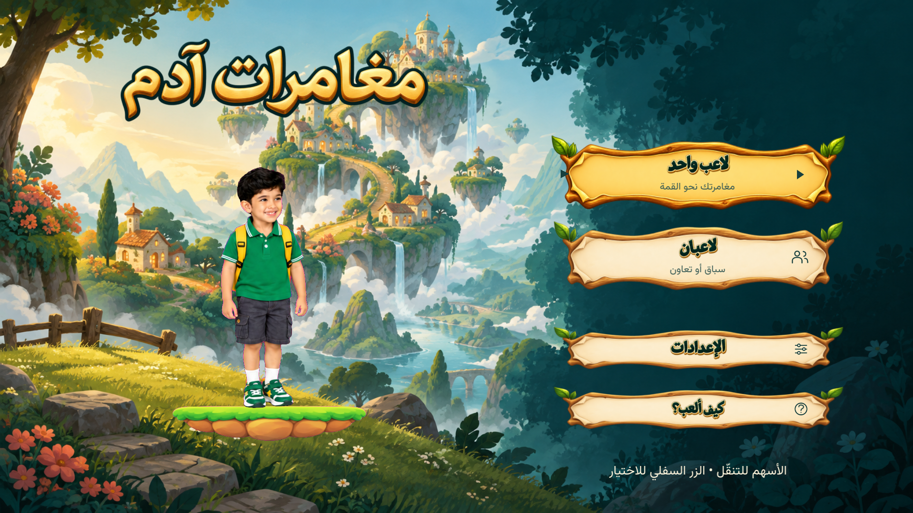
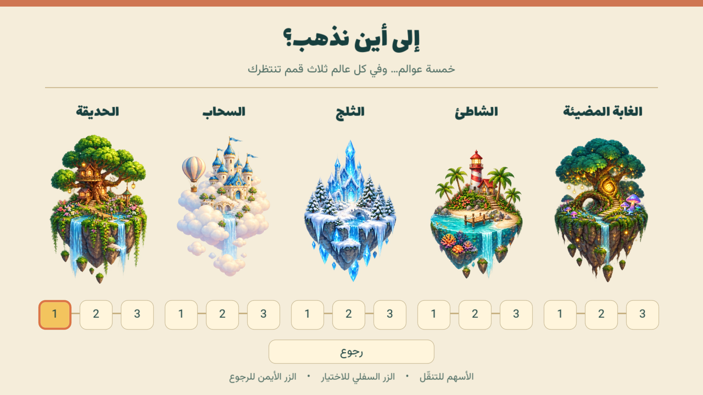
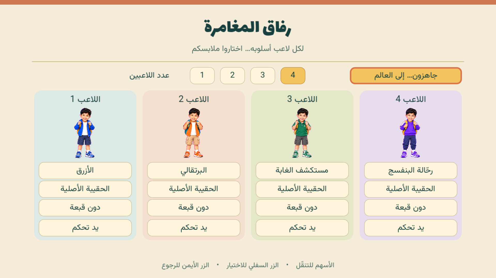
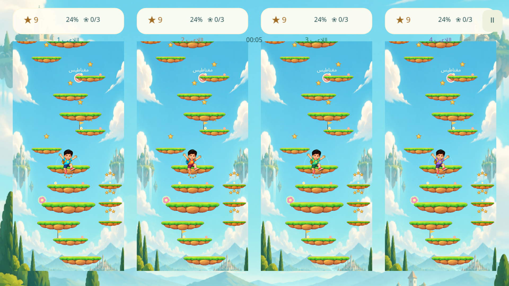

## الجديد في 0.8.18

إعادة توزيع المرحلة الأولى: أزيل تكرار المسارين على شكل S، واستُبدل بتوزيع ثابت غير متكرر على عرض الساحة، بمسافات مقيدة بمدى القفزة. أصبح طول المرحلة مستقلًا: **120 صفًا و63 أرضية جانبية** بدل 52 صفًا و49 أرضية جانبية. لا تُضاف أرضية جانبية إلى كل صف، لتبقى الخيارات واضحة وتتفاوت طرق الصعود. بقية المراحل والوضع غير المتناهي يحتفظان بطولهما وهندستهما وفيزيائهما السابقة.

زمن الاختبار الآلي عند سرعة 100٪ نحو **25–32 ثانية** بحسب اختيار الأرضيات والصعوبة، مقارنة بنحو 9–20 ثانية في التخطيط السابق. هذه نتيجة اختبارات توجيه آلية وليست وعدًا بزمن اللاعبين الفعلي. لا يمكن بلوغ القمة بالتوقف في عمود ثابت. القفزة وحجم آدم وخيارات السرعة حتى 200٪ باقية كما في الإصدار السابق.

الطين والأرضيات التي تختفي من أول هبوط تظهر فقط حيث يوجد بديل جانبي دائم. المساعدات والزهور والصناديق موزعة عبر الجزء المضاف أيضًا. تتناسب نسبة التقدم والقمة والحفظ مع الطول الفعلي، وتحتفظ الرحلات القديمة بنسبة التقدم والمقتنيات دون إضافة عقوبة سقوط. يعاد استخدام صور الأرضيات عند الانتقال إلى مرحلة أقصر، مع إخفاء الصور الزائدة.

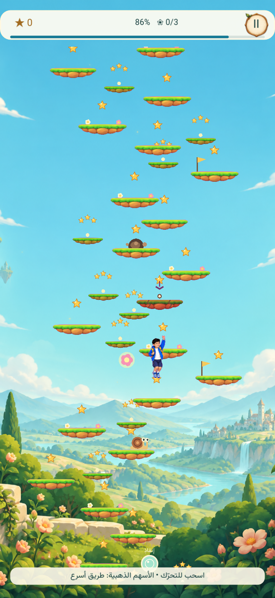
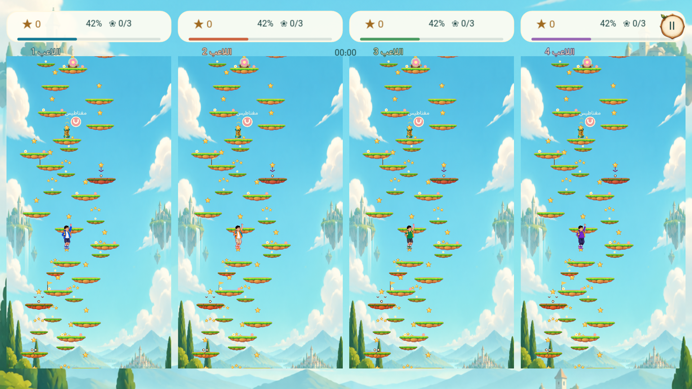

نجحت اختبارات المسار الأساسي والجانبي، والصعود بعد إزالة جميع الأرضيات المنهارة، ومخارج الطين والزنبرك، والسرعات، والحفظ والكاميرا والواجهة، وظهور الأرضيات بعد الصف 52 لأربعة لاعبين والانتقال إلى المرحلة التالية. قورنت هندسة وحركة 42 حالة من المراحل الأخرى بالنسخة السابقة. Android وiOS يحملان رقم البناء 34؛ ملف iOS التطويري يبقى محليًا.

## الجديد في 0.8.17

ضبط تجريبي للمرحلة الأولى فقط مستند إلى نسب مرجع القفز: آدم أصغر 20٪ مع الحفاظ على تناسبه، وأرضيات رئيسية بعرض 16–18٪ من الشاشة وجانبية 10–12٪. الارتفاع بين صفوف الأرضيات يتنوع من 7–11٪ من عرض شاشة الهاتف. يوجد 52 صفًا و49 أرضية جانبية، ومسار ينتقل بين الجانبين بحيث لا يمكن بلوغ القمة دون توجيه اللاعب.

القفزة العادية عند سرعة 100٪ تصل إلى نحو 2.6 مرة طول آدم، بزمن صعود نصف ثانية. يمكن اختيار أرضيات أعلى لتجاوز صفوف واختصار الطريق، مع بدائل دائمة للأرضيات التي تختفي عند الهبوط ومخارج جانبية وشرائط جافة للطين. حساب الزنبرك يراعي القفزة الجديدة وخطوة المحاكاة الفعلية، ويختار هبوطًا مفيدًا بدل زيادة زمن التحليق بلا تقدم؛ حتى قرب القمة يختصر زمن الوصول. ما زالت السرعات من 80٪ إلى 200٪ متاحة.

الكاميرا تحتفظ بمساحة إضافية أسفل الشخصية لرؤية الأرضيات أثناء النزول، وتظل فريمات الحركة السبعة متناسبة مع إيقاع القفزة. تُستعاد الرحلة القديمة في المرحلة الأولى عند أرضية آمنة دون زيادة عدد السقطات. هندسة وفيزياء المراحل الأخرى والوضع غير المتناهي لم تتغير؛ قورنت هندسة وحركة 42 حالة مرحلة/صعوبة بالنسخة السابقة.

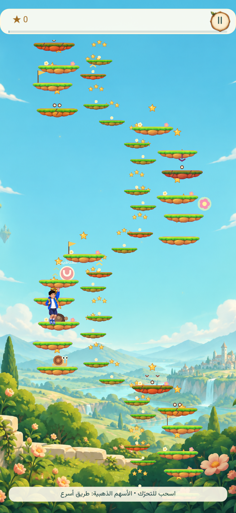
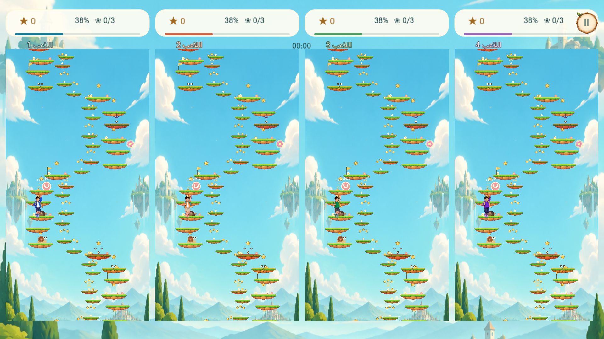

نجحت اختبارات المسارين، والتوقف في أعمدة ثابتة، ومخارج الطين، واختفاء الأرضيات، والزنبرك قرب منتصف المرحلة والقمة، والحفظ والكاميرا والواجهة والسرعات وأربعة لاعبين. تمت مراجعة العرض محليًا على أبعاد الهاتف والتلفاز. نسختا Android وiOS تحملان رقم البناء 33؛ حزمة iOS تطويرية محلية ولا تُنشر على GitHub. أداء Shield وTV Stick والتوجيه اليدوي على الأجهزة الفعلية ما زال بحاجة إلى اختبار.

## الجديد في 0.8.16

مساحة الحركة أعرض بنحو 21٪: 680 بدل 560 وحدة. الأرضيات العادية أصغر 16٪، والجانبية أصغر 12٪، مع أرضيات جانبية إضافية في كل المراحل وخيارات إضافية في الصعود اللا نهائي. عرض اللاعب الواحد على التلفاز أكبر، والفواصل بين اللاعبين أصغر. تبقى نقطة الانطلاق والقمة ونقاط الحفظ مريحة للهبوط.

خمس سرعات من الإعدادات أو تجهيز طريقة اللعب: **80٪، 100٪، 120٪، 150٪، 200٪**. نفس الإيقاع للجميع، ويُطبق عند بدء المرحلة. المحاكاة بخطوات ثابتة 60Hz، فتسارع الحركة لا يغيّر مسافة القفزة أو دقة اصطدام الأرضيات. تُستكمل الرحلات القديمة بأمان من نقطة الحفظ، أو آخر أرضية في الوضع المساعد، دون احتساب سقوط إضافي بسبب تحديث التخطيط.

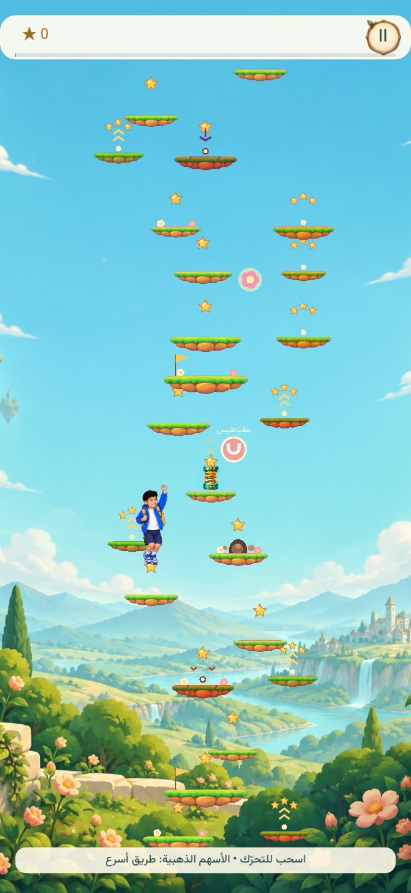
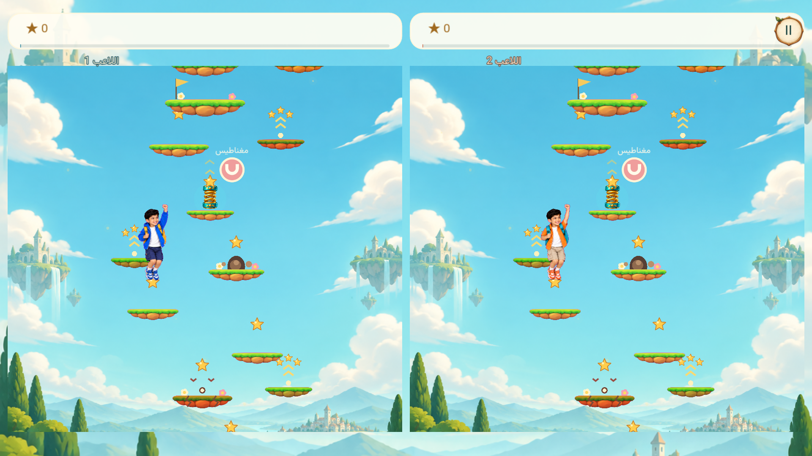
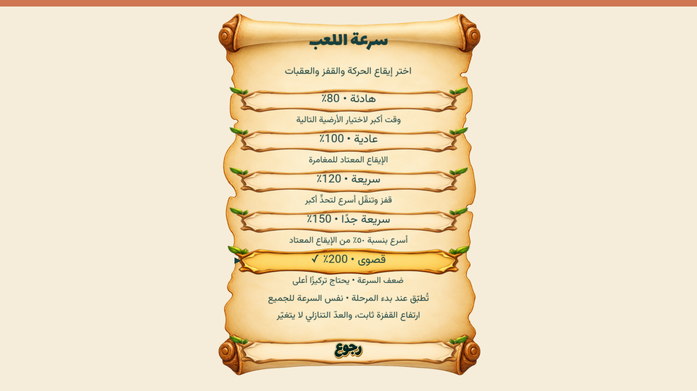

نجحت اختبارات الصعود والمسارات البديلة للمراحل الخمس عشرة والصعوبات الثلاث، ومخارج الطين والأرضيات المنهارة والزنبرك، والسرعات حتى 200٪، وسباق أربعة لاعبين والحفظ والواجهة. تمت مراجعة شكل الهاتف والتلفاز محليًا. قياس أربعة مشاهد على Mac M1 Pro: p95 نحو 10.7ms للإطار؛ أداء Shield وTV Stick يحتاج قياسًا على الجهاز الفعلي.

## الجديد في 0.8.15

ثلاث سرعات للعبة بالكامل: **هادئة 80٪، عادية 100٪، وسريعة 120٪**. الاختيار من الإعدادات أو من تجهيز اللعب ← طريقة اللعب. تبقى العادية هي الافتراضية، والاختيار محفوظ، وتُطبّق السرعة عند بدء المرحلة أو المحاولة التالية لجميع لاعبي التلفاز بالتساوي.

القفزة تحافظ على ارتفاعها وهندسة هبوطها؛ المحاكاة تستعمل خطوة ثابتة، ويتغير إيقاع مرور الوقت والحركة والعقبات. يبقى العدّ التنازلي والصوت والتنقّل بالسرعة المعتادة. الوقت المعروض هو الوقت الفعلي أثناء اللعب، والرحلة المحفوظة تستعيد سرعتها الأصلية. الحفظ القديم يستعمل السرعة العادية.

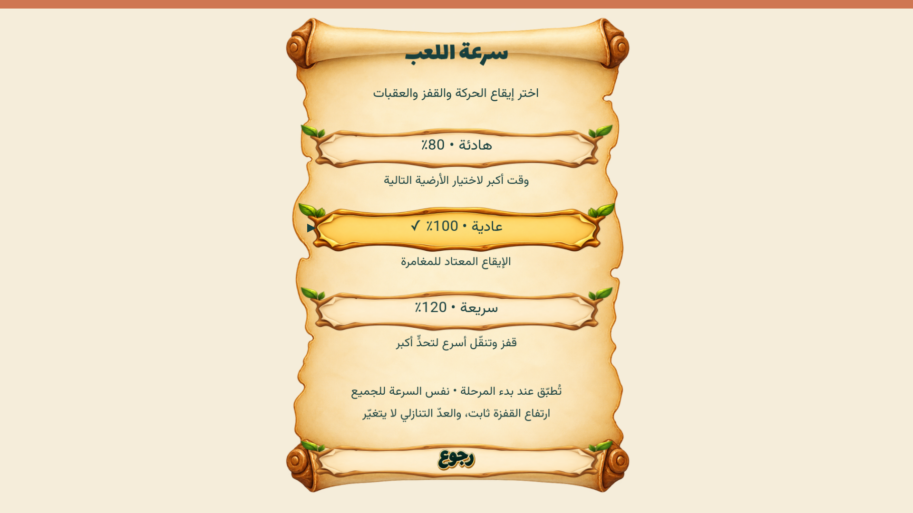
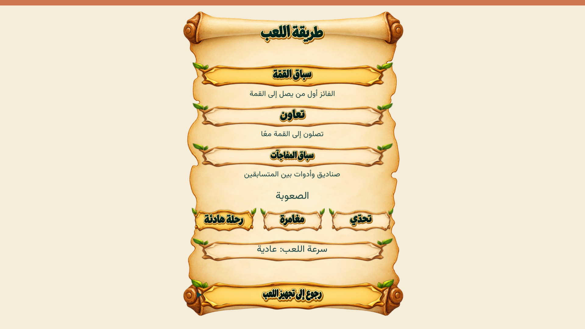
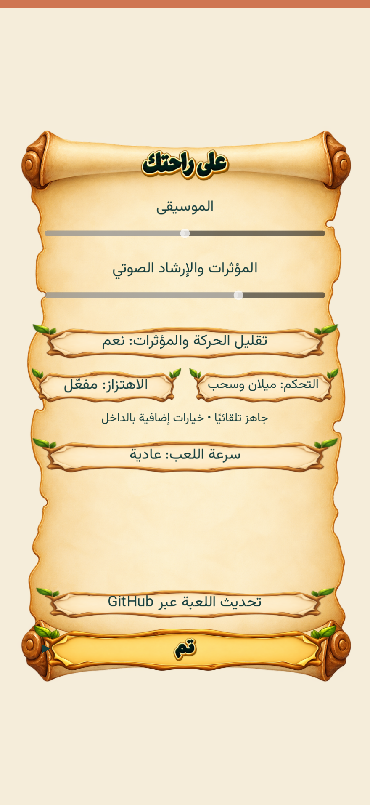

نجحت اختبارات السرعة وتكافؤ المسارات لأربعة لاعبين، واختبارات الصعود عند السرعة الهادئة والسريعة في كل عالم وكل صعوبة، والحفظ والكاميرا والواجهة ويد التحكم وتسلسل القوائم ومتابعة العوالم والصعود غير المتناهي. سقف العرض يبقى 60 FPS؛ هذا ليس قياس أداء على جهاز تلفاز فعلي. لم تتغير هندسة المراحل أو مستويات الصعوبة.

## الجديد في 0.8.14

تصحيح تموضع الكتابات داخل اللافتات: العنوان والوصف في وسط المساحة الفاتحة، والأيقونة في مساحة مستقلة على اليمين. أصبحت خيارات التجهيز أعلى قليلًا لتتسع للسطرين دون الاقتراب من الخشب، مع هوامش متناسبة للأزرار الكبيرة والصغيرة وترتيب متكيف على الهاتف والتابلت والتلفاز.


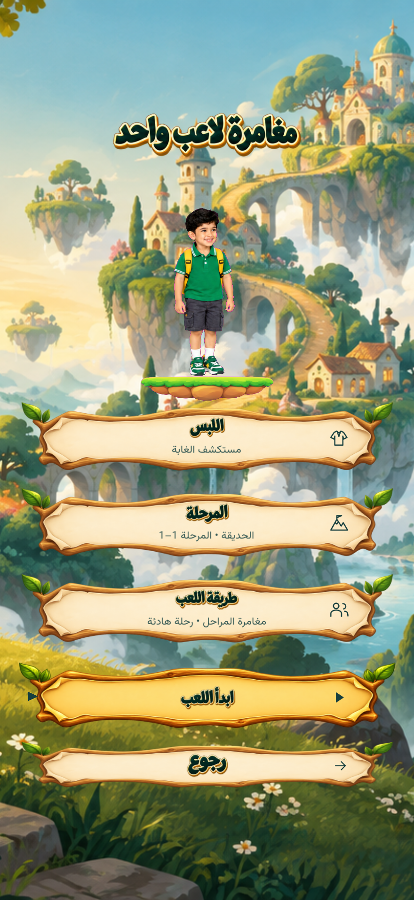
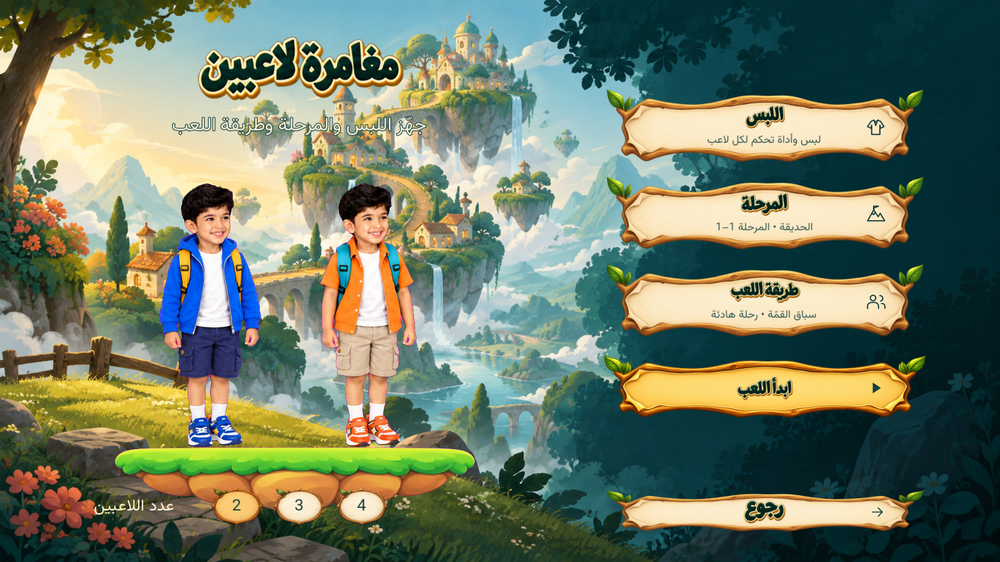

نجحت اختبارات محاذاة الكتابات وحدودها وفصلها عن الأيقونة، والواجهة وتسلسل القوائم ويد التحكم. جرت مراجعة لقطات محلية لأحجام الهاتف والتابلت والتلفاز. لم تتغير الرسومات الأصلية أو فيزياء اللعب والمراحل.

## الجديد في 0.8.13

عنوان «مغامرات آدم» مصمم ككتابة عربية مرسومة، مع 48 عبارة مرسومة لأزرار الرئيسية والتجهيز والأطوار والصعوبة وعناوين العوالم والقوائم وشاشات النهاية. الألوان الخضراء الداكنة والحواف الذهبية تناسب لافتات المغامرة. تبقى الشروحات الصغيرة والأرقام والحالات المتغيرة نصوصًا واضحة، وتُحفظ أسماء الأزرار العربية للتنقل وإمكانية الوصول.

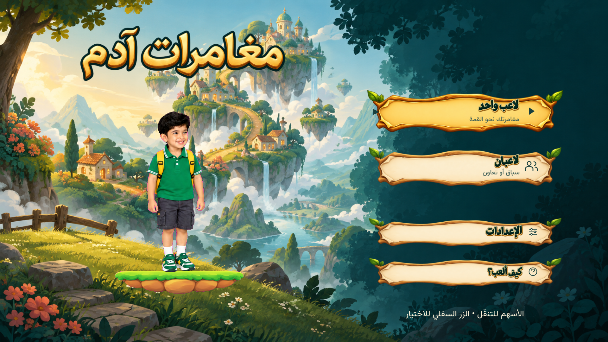
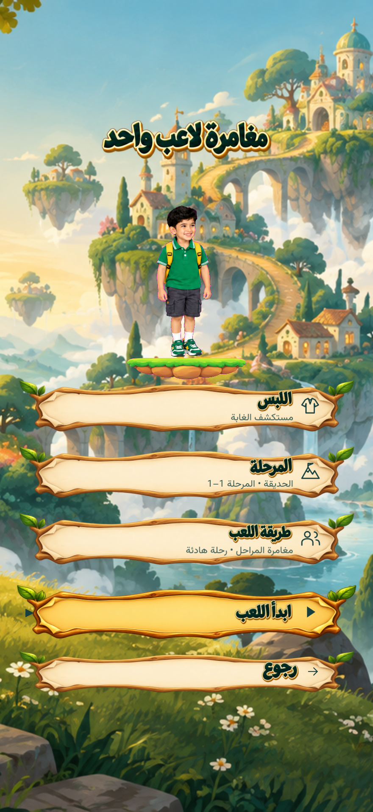

الرسومات تستخدم أربع صور شفافة مشتركة، مع مناطق عرض محفوظة وmipmaps، دون قص أو تحليل للصور أثناء اللعب. نجحت اختبارات الكتابات وحدودها وتمرير الإدخال والواجهة وتسلسل القوائم ويد التحكم، وفحص حواف مناطق الصور. لم تتغير فيزياء اللعب أو هندسة المراحل.

## الجديد في 0.8.12

رسومات خاصة للقوائم مولّدة بالصور: لافتات خشب وورق بحواف طبيعية وأوراق خضراء، لون ذهبي للبدء والاختيار، لفافات ورقية للقوائم الداخلية، وأزرار صغيرة محفورة لاختيار الأعداد والصعوبة. النصوص العربية تبقى نصوصًا داخل اللعبة، مع مسافات تحميها من حواف الخشب. يبقى ترتيب اختيار اللاعبين ثم تجهيز اللبس والمرحلة وطريقة اللعب كما في 0.8.11.

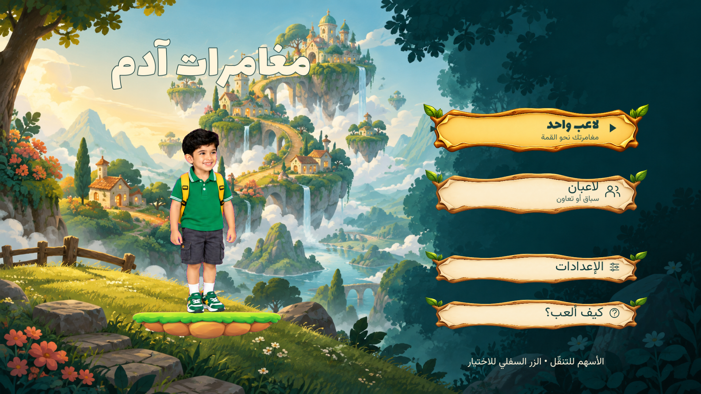
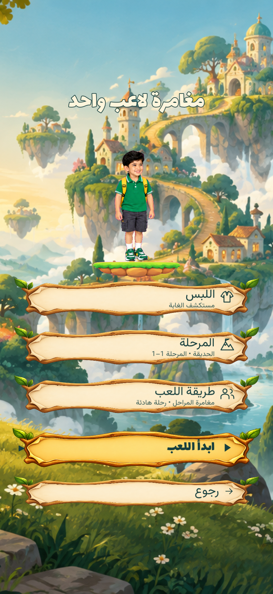
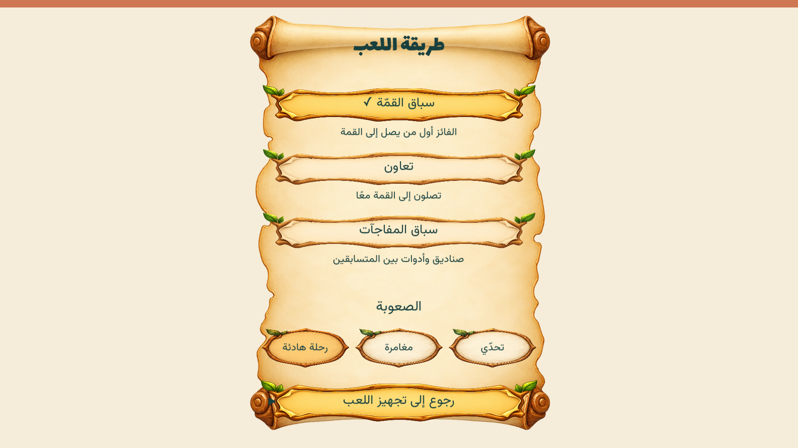

نجحت اختبارات الواجهة وتسلسل القوائم ويد التحكم. تمت مراجعة شكل القوائم على الهاتف والتابلت والتلفاز محليًا. الصور ثابتة ومشتركة، مع ترشيح mipmaps؛ لا توجد معالجة صور لكل إطار. قياس الأداء على التلفاز الفعلي يبقى اختبارًا على الجهاز.

## الجديد في 0.8.11

الرئيسية على التلفاز فيها أربعة خيارات فقط: **لاعب واحد، لاعبان، الإعدادات، وكيف ألعب**. اختيار عدد اللاعبين يفتح شاشة مستقلة لتجهيز **اللبس، المرحلة، وطريقة اللعب** ثم **ابدأ اللعب**. يرجع كل اختيار إلى التجهيز مع بقاء الخيارات المحددة. اللاعب الثالث والرابع متاحان داخل التجهيز الجماعي. على الهاتف والتابلت تبقى اللعبة للاعب واحد.

طريقة اللعب تضم مغامرة المراحل أو الصعود اللا نهائي للفردي، والسباق أو التعاون أو سباق المفاجآت للجماعي، مع اختيار الصعوبة. شرح «كيف ألعب» يرجع للرئيسية عند إغلاقه. زر الرجوع في اليد والريموت وAndroid يتبع ترتيب القوائم.

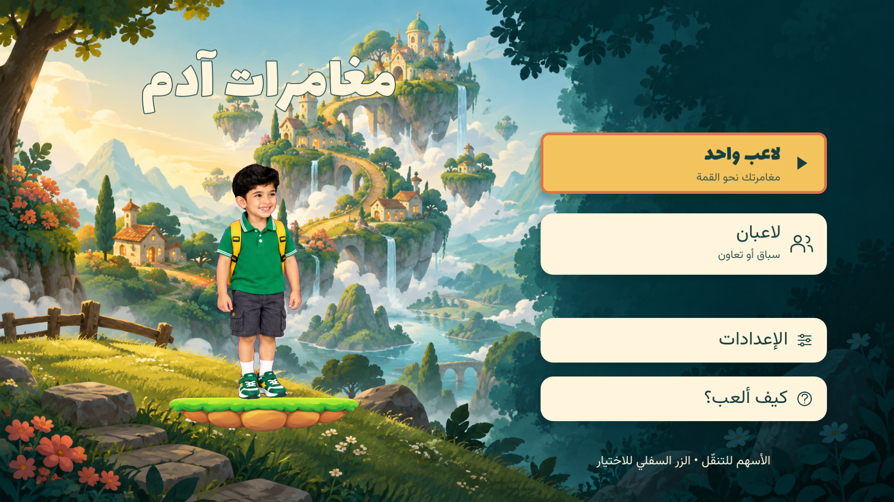
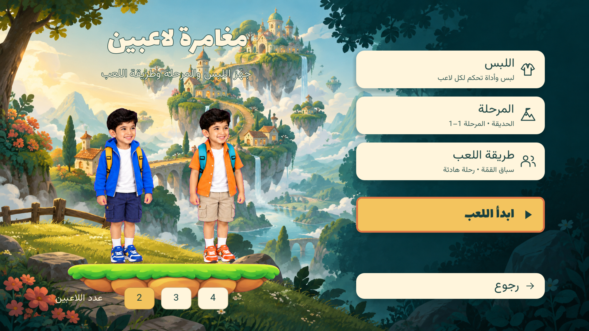
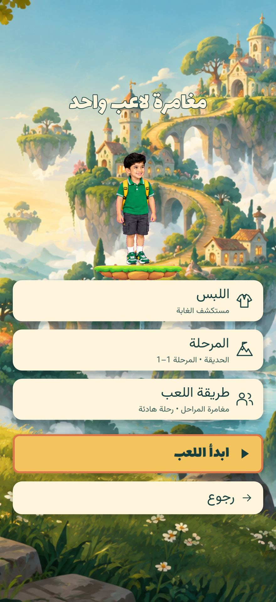

نجحت اختبارات تسلسل القوائم والواجهة ويد التحكم ومتابعة عوالم التلفاز والصعود اللا نهائي. روجعت لقطات محلية لأحجام الهاتف والتابلت والتلفاز؛ سلوك اللعب وفيزياؤه لم يتغيرا في هذا الإصدار.

## الجديد في 0.8.10

شاشة بداية أوضح مع آدم على أرضية من اللعبة، ومعاينة العالم المختار وأيقونات للأزرار. الميلان والسحب جاهزان بإعدادات متوازنة في التثبيت الجديد، ويتوسّط الميلان تلقائيًا عند بدء اللعب واستئنافه. داخل إعدادات اللعبة توجد خيارات اختيارية لطريقة التحكم وحساسية الميلان والسحب وعكس الميلان واستعادة التحكم الافتراضي. الاختيارات المحفوظة سابقًا تبقى محفوظة.

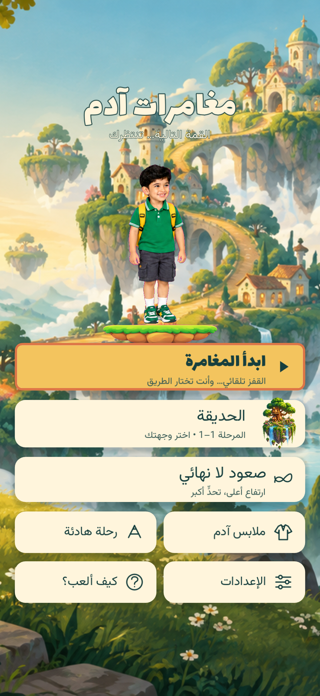
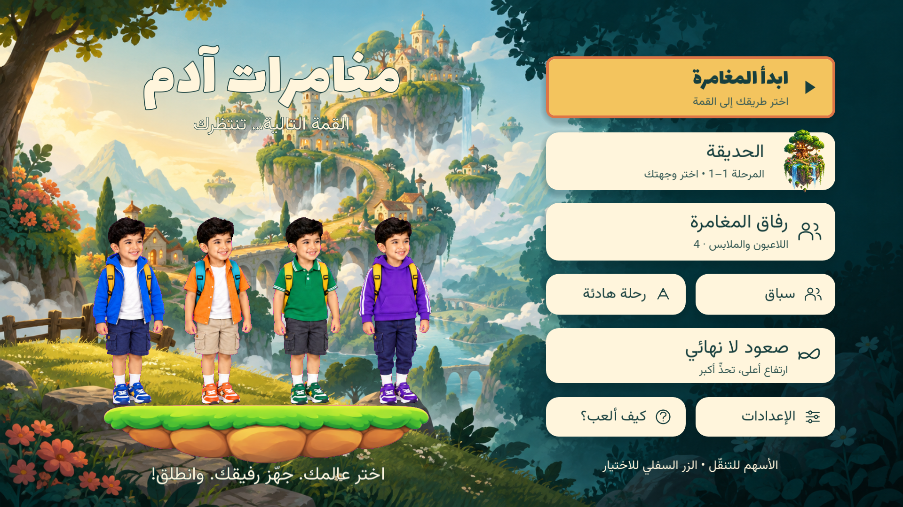

تحققت اختبارات القوائم والتنقّل بيد التحكم وحفظ الخيارات وأولوية السحب. تمت مراجعة لقطات محلية للهاتف والتابلت والتلفاز؛ قياس استجابة حساسات الهواتف والأداء على أجهزة التلفاز الفعلية يبقى اختبارًا على الجهاز.

## التحديث من داخل اللعبة

ثبّت الإصدار 0.7.0 يدويًا مرة واحدة، ثم اختر **الإعدادات ← تحديث اللعبة عبر GitHub** للتحديثات التالية.

على Android، تتحقق اللعبة من إصدارات المستودع العامة (بما فيها النسخ التجريبية)، وتنزّل APK عند اختيارك، وتتحقق من بصمة SHA-256، ثم تفتح مثبّت Android. قد يطلب النظام السماح للتطبيق بتثبيت التحديثات. يلزم الاحتفاظ بمفتاح توقيع Android نفسه في الإصدارات اللاحقة.

على macOS تُفتح صفحة التنزيل. ملف iOS العام غير موقّع ويحتاج توقيع Apple قبل التثبيت؛ لا يوجد تثبيت مباشر لتحديثات GitHub على iPhone أو توزيع TestFlight في هذا المشروع.

اللعبة محلية دون حسابات أو إعلانات أو تحليلات. يُستخدم الإنترنت فقط عندما تطلب التحقق من التحديثات أو تنزيلها.

## Build from source

Use Godot 4.7.2 and matching export templates. Open `project.godot`, then run the main scene. Desktop TV preview:

```sh
godot --path . -- --tv
```

For Android, install the Android build template and SDK/JDK, then run `python3 scripts/prepare_android.py` before exporting. The script includes TV detection and the native APK installer/FileProvider bridge. Configure local signing keys in Godot; none are included here. Export macOS using its preset. For iOS, set your own Apple team, export the Xcode project and sign using your own provisioning. The macOS build is not notarized.

## Validation and device limits

Simulation, feature, surprise-mode, UI, controller-menu and four-player progression tests passed. Live GitHub metadata retrieval and APK download/hash verification passed. The native Android installer opened and completed an update on an emulator. The 0.8.0 desktop four-view benchmark measured 162.6 µs median scene-update CPU time, 187 median draw calls and 5.875 ms uncapped frame p95. These are desktop measurements, not Shield or Xiaomi hardware results. See [benchmark method and limits](design/PERFORMANCE-071.md).

Android requires OpenGL ES 3.0. The original GLES2-only Full HD Mi TV Stick is unsupported. Newer Xiaomi sticks, Shield, individual Xbox/PlayStation/Nintendo controller models, foldables and physical 4K TV performance still require hardware validation. Android may expose a lower-resolution app surface than the television's panel resolution.

```sh
godot --headless --editor --path . --import
godot --headless --path . --script tests/test_race.gd
godot --headless --path . --script tests/test_features.gd
godot --headless --path . --script tests/test_surprise.gd
godot --headless --path . --script tests/test_ui.gd -- --test
godot --headless --path . --script tests/test_controller_menu.gd -- --test
godot --headless --path . --script tests/test_four_updates.gd -- --test
```

`tests/test_update_download.gd` additionally downloads an APK from GitHub to verify the complete download/hash path. Test scripts using `--test` use separate save storage. See [TV design and validation notes](docs/TV-070.md).

## Design and assets

Version 0.7.3 adds four newly drawn Adam outfits with five animation poses each, registered feet and hat anchors, and a dedicated character shader. See [character art and validation](design/CHARACTERS-073.md).

The 0.7.1 menus use original painterly camp and island artwork, Lalezar Arabic headings and Vazirmatn body text, informed by [Mobbin references](https://mobbin.com/screens/2656db04-1eb5-4568-9e7d-132256423855). See [design rationale](DESIGN.md) and [generated-art prompts](design/ART-080.md). No gameplay features were added in this refinement. The original reference photograph, personal files and signing profiles are excluded. Font licensing is in `assets/FONT-LICENSE.txt` and `assets/fonts/*OFL.txt`.

Version 0.7.4 redraws the jump, descent and landing as focused adventure movement. [Details](design/ADVENTURE-074.md).

Version 0.7.5 uses seven compact jump poses plus idle/victory, with feet kept under the body for clearer landings. [Details](design/JUMP-075.md).

Version 0.7.6 restores Adam’s natural likeness across all four outfits, retains the approved seven-phase jump, aligns the sole midpoint when facing either direction, and removes hats. [Art and validation](design/IDENTITY-V8.md).

Version 0.8.0 extends every stage from 34 to 52 jumps and gives each three-stage world distinct pacing. Springs use a stage-specific launch profile; mud, sticky traps and creatures delay the next launch without altering descent speed. TV adds «سباق المفاجآت» for two to four players. Independent boxes provide a six-second one-hit shield, 1.8-second seeded ink splats covering about 40% of the playfield, a 0.4-second sticky delay, two boosted jumps, or a 1.2-second invisibility penalty. Attacks target the nearest racer ahead, do not stack, and boxes end well before the summit.

Version 0.8.1 replaces the fixed edge ink with seeded organic splats distributed randomly across the playfield at about 40% coverage. A new hand-painted transparent atlas supplies the chest, shield, ink, sticky trap, spring and invisibility art. Pickup/use/hit pulses, visible shield and delay states, slim HUD progress rails, held-item icons and subtle world-colored atmosphere complete the visual pass. Reduced-effects mode keeps a cheaper contour variant.


Version 0.8.2 redraws the spring upright and calculates a useful two- or three-platform target for every stage. Raised gold alternate routes use unequal spacing and widths; double chevrons mark only routes verified to save time. The touch item action is sized for iOS/Android and appears only when a multiplayer surprise race has a valid opponent.

Version 0.8.3 removes the fixed 540×960 phone window override and uses the physical iOS/Android display aspect with expand scaling. Tall phones and foldables now fill the complete screen while safe-area insets continue to protect the Dynamic Island, camera area and home indicator.

Version 0.8.4 makes the single-player phone playfield edge-to-edge and removes the second differently cropped background that formed a visible rectangle inside the screen. TV split-screen panels keep independent backgrounds.


## Version 0.8.5

- A more compact phone HUD exposes more of the stage.
- The movement guide fades out during normal play and returns briefly when useful.
- A subtle landing marker helps phone players judge where a descending jump will land.
- Gameplay physics, scoring, and TV multiplayer behavior are unchanged.


## Version 0.8.6

Stage 1-1 now has smaller main platforms, a wider range of jump heights, and more than twenty additional route surfaces. Mud can be skirted on its clear edge or bypassed on a raised side route. Seven new coral platforms break on first contact, and every one has a permanent green alternative so the climb cannot become a dead end. These geometry changes apply only to the first stage.


## Version 0.8.7

Stage 1-1 has smaller landings and a wider range of jump heights. Three violet platforms collapse on contact without launching the player; each has a safe green bypass. A new solo Endless Climb gradually narrows and raises the platforms as the player ascends. Falling ends the run immediately, with a local best score based on maximum height.


## Version 0.8.8

Stage 1-1 and Endless Climb now use smaller platforms and greater variation in jump heights. The playfield camera zooms out by 10% on phone and TV so players can see more of the climb; touch steering compensates for the new scale. Safe routes remain available around every immediate-collapse platform.


## Version 0.8.9

Phone Settings now offer optional tilt steering with a recenter button. Gravity supplies the stable angle, a gyroscope reading helps responsiveness, and finger dragging remains available. Landings across the adventure and Endless Climb are smaller, while mandatory steering gates remain reachable. Every adventure mud trap has clear landing edges and a permanent raised bypass; endless mud also offers both ways around it.
